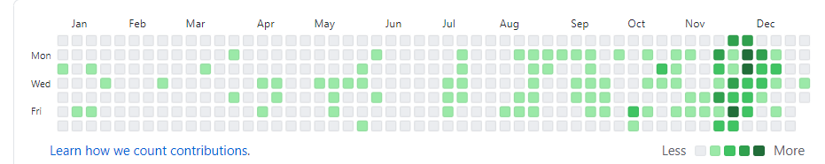

## 2020这一年
`革命还未成功-同志还需努力`

> 上半年
>
&nbsp;&nbsp;&nbsp; 工作之路真的是坎坷。经历了有史以来的滑铁卢。
是个意外，入职之前就是个棋子。
> 下半年
>
&nbsp;&nbsp;&nbsp; 重新找工作了。还算可以，技术还需要提升。还需要进步。
生活上也更好了。我跟我的小颖小小宝，订婚拉。
   
## 2019这一年  
`业精于勤,荒于嬉;行成于思,毁于随。`

&nbsp;&nbsp;&nbsp;&nbsp;今年是本命年，感觉自己活的一塌糊涂，今年有50天没有上班，也没有赚到什么钱，感觉工 
    作快3年了，曾经有的想法，今年都没有实现。 
&nbsp;&nbsp;&nbsp;&nbsp; 从朝九晚五到996，一开始真的不适，不过后来都可以了。慢慢成长。 
至少今天比昨天好。    

**原本计划** 

* 找一份自己喜欢的公司
* 软件中级资格证(大败北)
* 考驾校(科目一练习中)
* 技术学习(下半年工作太繁忙，基本无时间学习)

&nbsp;&nbsp;&nbsp;&nbsp;2020-1-14 早上8.49，突然有感想说。今天突然看到朋友圈前同事发的朋友圈，说实话，我羡慕了，有年终奖，年终有聚餐，一个项目小组其乐融融。
&nbsp;&nbsp;&nbsp;&nbsp;而不是像我旁边的同事，勾心斗角，阴险狡诈，哈哈，我竟然会说出这样的话。甜甜的项目组什么时候会轮到我啊。啊啊啊啊。
&nbsp;&nbsp;&nbsp;&nbsp;以前项目有问题，我们会一起解决，一起交流，一起抢需求写。而现在，同事除了甩锅还是甩锅，需求都乱甩，组长也无所事事，只是个混子。

## 2018这一年
`只有活着才能学习。 `

