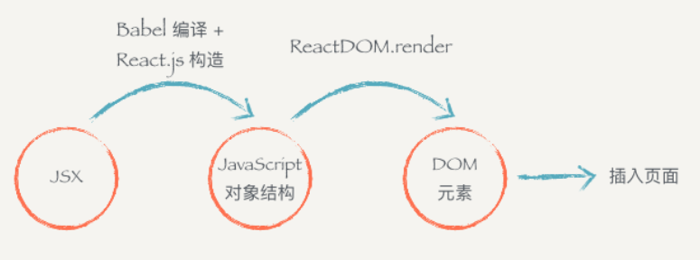

---
title: react笔记  
autoGroup-react: react  
--- 

# 全家桶
jsx->js对象->dom


## 1、Redux  状态管理
## 2、React-router 路由
## 3、webpack
 * 运行前需要把文件都推到git或svn上
* 需要修改webpack就需要运行`npm run eject`

## jsx模板语句
1、多个className
```js
  //1
 
className={`title ${index === this.state.active ? 'active' : ''}`}

//2
className={["title", index === this.state.active?"active":null].join(' ')}

//3

var classNames = require('classnames');
 
var Button = React.createClass({
  // ...
  render () {
    var btnClass = classNames({
      btn: true,
      'btn-pressed': this.state.isPressed,
      'btn-over': !this.state.isPressed && this.state.isHovered
    });
    return <button className={btnClass}>{this.props.label}</button>;
  }
});

```

## 父子组件传参
**父组件代码**
```js
class Father extends Component{
    render(){
        return (
            <div>
                <h2>我是父亲组件</h2>
                //引入子组件
                <Child/>
            </div> 
        )
    }
}
```

**子组件代码**
```js
class Child extends Component{
    render(){
        console.log(this)
        return (
            <div>
                <h2>我是子组件</h2>
                <div>点我向父组件传值</div>
            </div> 
        )
    }
}
```


1、父传子
* 直接在子组件上声明`props`
**父组件代码**
```js
class Father extends Component{
    render(){
        return (
            <div>
                <h2>我是父亲组件</h2>
                //引入子组件
                <Child fatherVal='666' />
            </div> 
        )
    }
}
```
* 子组件直接
`this.props.fatherVal` 就可以使用了

2、子组件传父组件
* 父组件写好子组件的点击事件
* 父组件利用`props` 把自己传到子组件内
**父组件代码**
```js
class Father extends Component{                fatherClick(childVal,e){                                console.log(e.target,childVal)  
    }  
    render(){   
        return (  
            <div>     
                 <h2>我是父亲组件</h2>   
                 <Child  news={this} />     
            </div>  
        ) 
     }
 }

```
* 子组件利用父组件的方法把值传过去

**子组件代码**
```js
class Child extends Component{  
    render(){    
                console.log(78,this)   
                return (      
                <div>       
                        <h2>我是子组件</h2>       
                        <button   onClick{this.props.news.fatherClick.bind(this,'666')}>我是 
                        子组件的按钮</button>     
                </div>   
        )  }
}


```

## ref

https://www.jianshu.com/p/56ace3e7f565