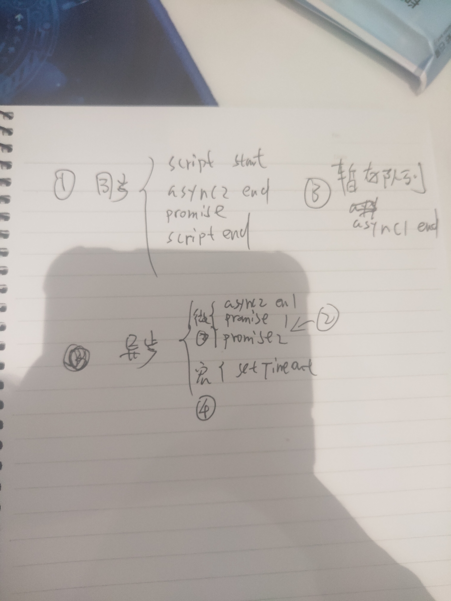

 
<Meta/>  

[部分摘自](https://juejin.im/post/6844903988584775693)

## Generator 原理
协程概念
>一个线程（或函数）执行到一半，可以暂停执行，将执行权交给另一个线程（或函数），等到稍后收回执行权的时候，
>再恢复执行。这种可以并行执行、交换执行权的线程（或函数），就称为协程。

### demo1
```js
  //generator
  //Generator 函数是一个状态机，封装了多个内部状态。
  //一是，function关键字与函数名之间有一个星号；
  //二是，函数体内部使用yield表达式，定义不同的内部状态（yield在英语里的意思就是“产出”）。
  function* helloWorldGenerator(x) {
    console.log(15, x) //1
    yield function (nextVal){console.log(nextVal)};
    yield 'world';
    return 'ending';
  }

  var hw = helloWorldGenerator(1);//调用后 该函数并不执行
  //next 方法会逐步向下执行
  console.log(1, hw.next().value(2))//2
  console.log(2, hw.next())//{value: "world", done: true}
  console.log(3, hw.next())//{value: "ending", done: true}
  console.log(4, hw.next())//{value: "undefind", done: true}
```

## 异步队列题目
```js
  console.log('script start')

  async function async1() {
    await async2()
    console.log('async1 end')
  }
  async function async2() {
    console.log('async2 end')
    return Promise.resolve().then(()=>{
      console.log('async2 end1')
    })
  }

  async1()

  setTimeout(function() {
    console.log('setTimeout')
  }, 0)

  new Promise(resolve => {
    console.log('Promise')
    resolve()
  })
    .then(function() {
      console.log('promise1')
    })
    .then(function() {
      console.log('promise2')
    })

  console.log('script end')
```
> 结果
> 