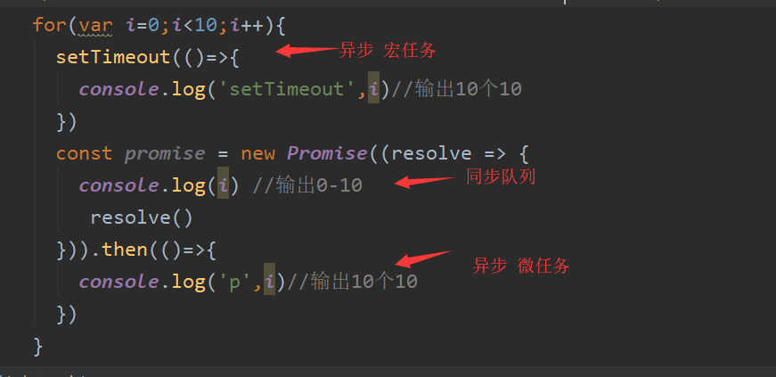
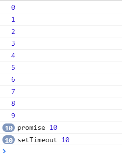

---
title: 异步编程
autoGroup-javascript: javascript  
---  
<Meta/> 

## 队列demo1
```js
   for(var i=0;i<10;i++){
     setTimeout(()=>{
       console.log('setTimeout',i)//输出10个10
     })
     const promise = new Promise((resolve => {
       console.log(i) //输出0-10
        resolve()
     })).then(()=>{
       console.log('p',i)//输出10个10
     })
   }
``` 
**同步>异步（微任务>宏任务）**  
  
 

---  

输出结果  

