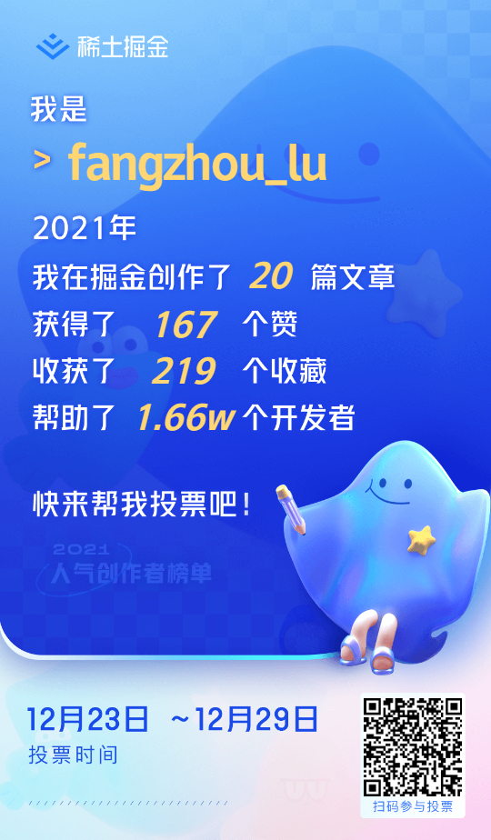
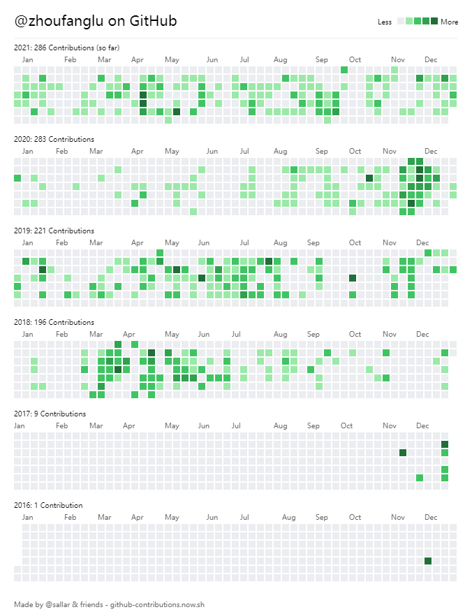

---
title: 2021年度总结
categories: 随笔
sticky: 1
tags: [回忆录]
---  
 
<Meta/>
## 掘金
*   
* 总结下我认为写的最好的两篇文章 [1-动态路由](https://juejin.cn/post/7043988643941203975) [2-echarts自适应](https://juejin.cn/post/6958979078594494495)
* 今年掘金可以说是收获满满的一年，得到了很多赞，当然，对比大佬就是菜鸟，不过像我这样的吊车尾，很满意了。
* 当自己分享的技术被别人认可的时候，`更喜岷山千秋雪,三军过后尽开颜!`

## github
* 今年github收获了7个start..很满意了，往年一个都没。
*   

## 总结- `黑发不知勤学早，白首方悔读书迟。`  

### 说说自己
我一直都是很普通的人，我很懒散，老家在小县城，压着分数线考上高中，然后高三从倒数第3考到全班13名（考运很好），然后又压着分数线考上大学。。
命运女神一直站在我这边，从小喜欢打游戏，大学玩了四年游戏(lol一区钻二小丑，无敌！！)。。后来发现工作后还是戒不了游戏，后来为了工作，慢慢接触到前端，
慢慢开始徘徊，然而在这个行业内，我也很普通，我也很平凡，一直认为自己是螺丝钉(扮演的也是此角色)，但是，我现在想做螺丝刀。

### 说说公司  
今年没有跳槽，这里挺安逸的，很喜欢这种氛围，但是有两个一起工作过的同事离职了，那种离别的感觉真的不太好，太伤感了。想起了之前黄焖鸡老板的一句话，那时候我在那
打工了一个月，要走了，“老板，我要走了，可别想我啊！！！”， “你这不废话，跟狗呆了一个月，都会有感情，何况是人呢？”， 对了，老板才比我大一岁，那时候我在上大学
人家那时候已经在老家首付了一套房了，自己挣的，过了有6、7年了，我还没挣到。。。 

觉得满意的项目《xx风控xx系统》，自己也能独立搭建一个前端环境，可以撑起自己小组的前端了。觉得有意思的项目
《pdf-OCR》识别，这项目挺有意思，今年还接触了vue3项目，不过感觉写的代码有点烂，年后得补补，希望我能够改善功小组前端的环境。  

说来我也挺坎坷的，一开始在组A, 被分到了组B,一直被领导安排换组，那段时间感觉心里很迷茫，项目每次都是做一段就走人，突然有一天，接到个新项目，冥冥之中，自有天意吧，
可能生活是个圈，工作也是个圈。 我记得刚刚来上海的时候，指着对面的楼问： ‘xx电子口岸是干什么的？我老家也有xx个电子口岸’, 结果现在我在这里工作了。。人类的本质是复读机。

今年还第一次分享了东西，《聊一聊VUE3》,我记得是四月份的时候，还被领导夸赞了,上学知乎第一次感觉那么有成就感。感谢丹姐，丹姐人真的很好，哈哈哈。  

今年学会了很多技术吧，学了点react,学了nuxt,反正挺充实的。感谢ep这个平台，让我重拾了自我。  

### 说说生活
今年刷朋友圈，xxx落户了，xxx考上了高级系统架构师，说实话，很羡慕，别人也在努力。  
是的，没错，今年10月份，我跟我恋爱七年的颖宝结婚拉，真的挺不容易的。话说今年去旅游的地方挺多的，去了广州，去了[云南旅游记录](https://zhoufanglu.github.io/vuepressBlog/%E9%9A%8F%E7%AC%94/%E8%AE%B0%E5%BD%95%E6%97%85%E6%B8%B8.html)，
做了没做过的事，看了没见过的风景，长途漫漫，人生无限好。  
是的，我们今年还订了车，年前应该能拿到，这个东西犹豫了很久，17年就想着要遮风挡雨的东西, 希望不是买了个电动爹。
对了，我还胖了😂，比去年胖了估计有10斤，真的是，新年flag, 少喝奶茶，多运动(感觉不太会实现)。 
希望家人身体安好，一切平安，不求大富大贵，只求团团圆圆。

### 说说2022年目标
* 再次分享一次到两次技术。
* 提升英语能力，坚持学习。
* 参与新的项目，赚更多的钱。
* 希望能考个证吧，不然简历上都没什么亮点。
* 希望能当爸爸。🥰😘😘。
* 

