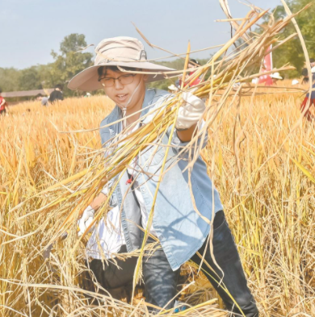

---
title: 个人回忆录
categories: 随笔
tags: [回忆录]
---  
 
<Meta/>  
 
* 记录突然想起来的回忆事件。 

## 童年卖冷菜的小哥
> 那时我还小，大概上5岁左右？  
> 每到下午4、5点，村上都会有个卖冷菜的骑着三轮车的小哥(不记得是不是电动的了)  
> 我们发小几个人，都会在他后面追着，索要冷菜吃，嘿嘿  
> 好心的小哥都会给们我拿点。。如今不知道过得如何。淳朴的老百姓。  

## 高中的手机_e63
* 由于高中没有手机，我的表哥送了我一部诺基亚手机e63,我一开始还嫌弃他丑。其实我哥是我们这一辈值得学习的榜样。

## 总有老去的一天 
**奶奶-候美玉, 爷爷-卢省凡**
>奶奶和爷爷，2017年大年夜
>  
* `2020-11-27` 想起了小时候，在老家，幼儿园或者小学，在家里不小心把二楼，父母房间内桌子上的锁弄坏了，怕的要死，跟奶奶说，
奶奶带我过了麦田，过了村口的桥，到了二队的小店，买了面包，好吃。
* `2020-12-14` 儿时玩具虽好，不如奶奶编鸟。 那时候还在老家，不知道多大，幼儿园或者小学一二年级，小时候因为有事情哭了，奶奶为了哄我，正好在剥蚕豆，奶奶
用蚕豆的壳，与稻草(稻草撕成Y字型)，用稻草插入蚕豆，就像鸟一样，把我逗的很开心。如下两张图拼接而成。  
> 
>  

* `2020-12-14` 愧疚与道歉。如果时间能够重来，我想回到从前，那时候或者在上高中/大学，奶奶身体还挺好。我在二楼打游戏。奶奶突然慢慢悠悠的爬到了二楼，
奶奶腿脚不利索，跟我嘱咐点事，我很不耐烦的说我奶奶，奶奶说：这电脑有什么好打的，我就很生气的说，不要你管，你烦死了。。我好想对我奶奶说声对不起。

