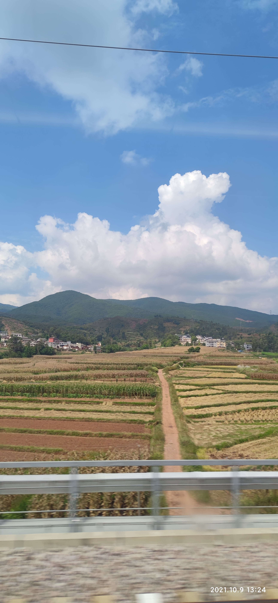
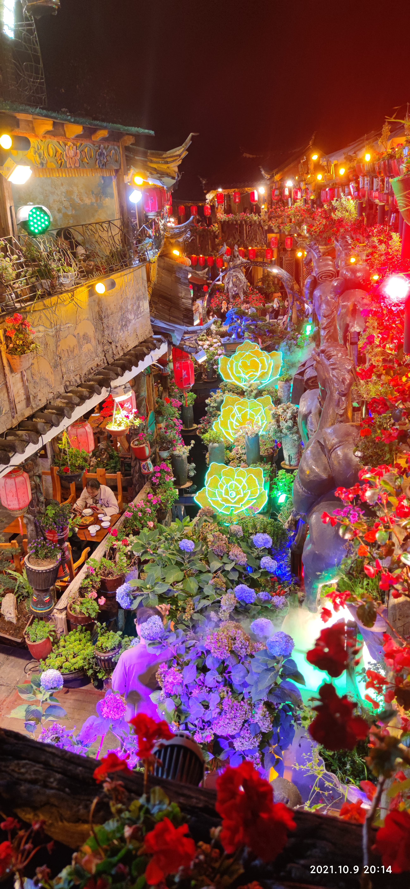
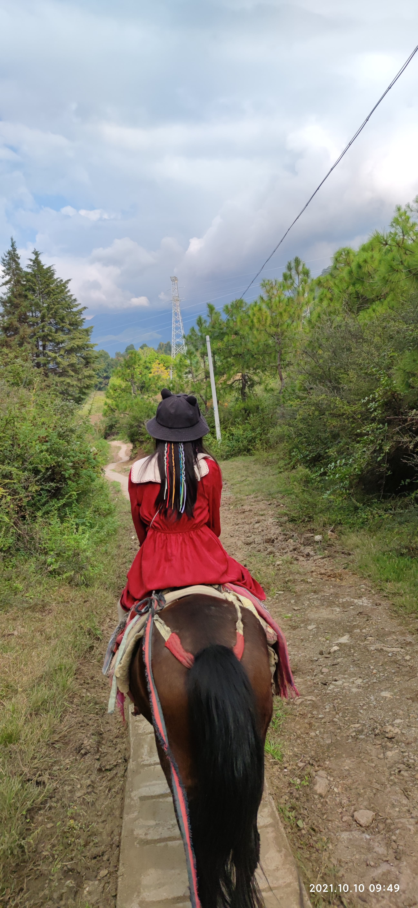
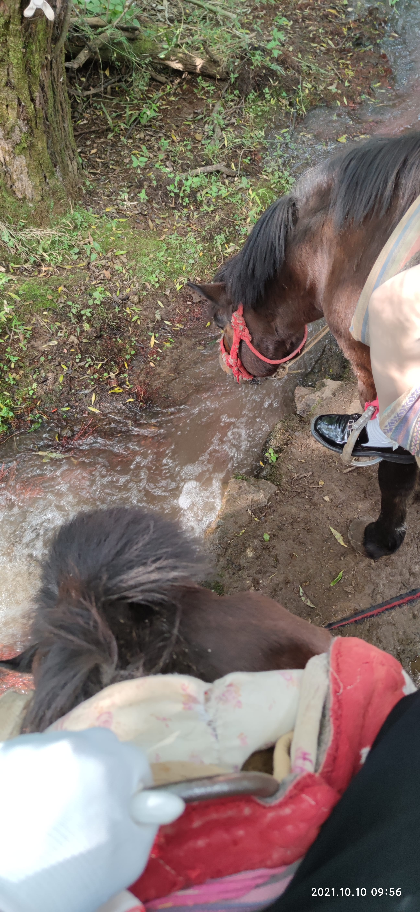
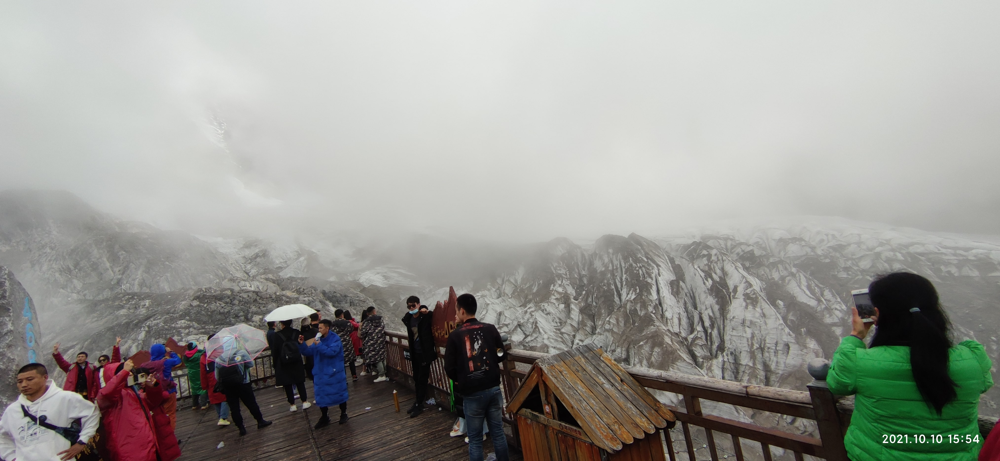
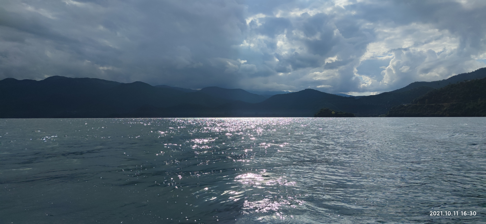
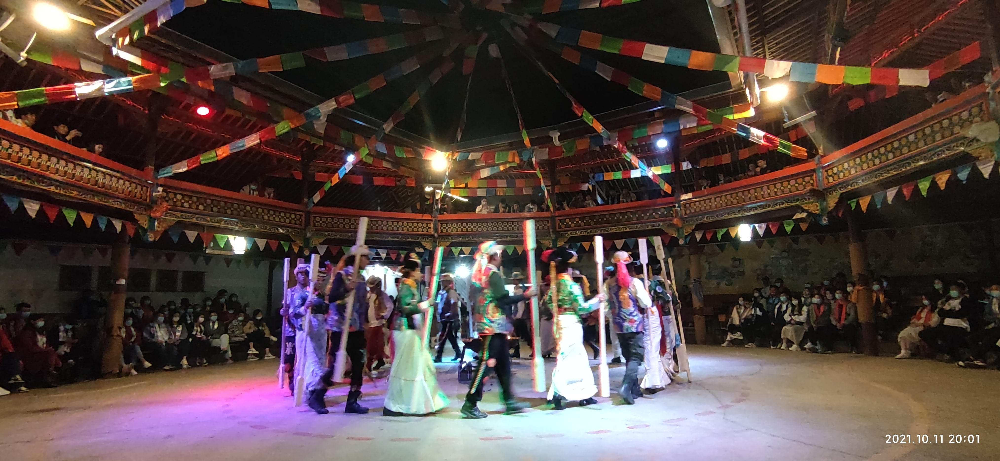

<Meta/>  

## 云南之旅
> 本人于2021-10-9 ~ 2021-10-14,累计6天的云南旅行

## 昆明
> 第一天到了昆明，啥都没干，遇到宾馆垃圾没倒，最后协商，补了50元差价。 
> 晚上吃了烧烤， 昆明没怎么玩第二天就去了丽江。

## 丽江
### 丽江第一天 - 古镇
> 坐动车去丽江，4个多小时，动车都是从山里穿过去的，以前高铁没通的时候
> 需要做绿皮火车12个小时，感谢政府的努力。   
> 到了丽江，就要交50元的费用，说是城市建设，这个有点坑 

* 高铁路上风景 
>  

* 下午4点多到了丽江，由于是报的团，导游给我们安排了民宿风格的酒店，十分完美。 
  
* 晚上逛了古镇，现在古镇基本都一个样，太商业化了，里面便宜的东西基本都是假货。
   
  
* 来了云南，就想吃云南菜，大众点评上找了一家 **云雪丽**， 巨TM难吃，还贵，人均100左右，
中途还有个菜里面有个卷卷的毛，找到服务员，结果送了一道菜，打了个8折。。
  
### 丽江第二天 - 拉市海 + 玉龙雪山
* 上午去丽江拉市海（好评）, 去乡下了，城里基本都是[纳西族](https://zh.wikipedia.org/wiki/%E7%BA%B3%E8%A5%BF%E6%97%8F)
* 骑马(280一人), 农村大爷牵马带我们走一遍茶马古道。风景美的很。
   
   
  
* 下午去玉龙雪山了(天气不太好，能见度低，雪少（10月份去的）)
* 建议每年冬天去，11月-4月份内去，
* 需要准备氧气罐（一人一瓶足够了）， 租一件棉袄。
* 4680登顶拍的，能见度太低，还下雨，建议晴天+冬天去，才好看
  
  
* 下午还去喝了茶， 女朋友被忽悠买了500元藏红花，我也买了包普洱茶。
  
### 丽江第三天 - 泸沽湖
* 到泸沽湖看了水性杨花（这种花的名字实际为波叶海菜花，渐危种，产于云南、四川，生于湖泊中，对水质要求极高。
  ），水很清，人很朴实，风景很美。
  
* 这里给大家介绍下摩梭人（当地老百姓跟我说的）  

1、摩梭人是母系社会，女人的地位最高，一般家里年长的女性最有话语权。  
  
2、女的不住在老公家，老公也不住在女的家，男性晚上去女方家，早上6点就回去。孩子也是
  女方家，跟女的姓。母系社会，女的地位高于一切。 不是女权，是本来就这样。  

3、摩梭人吃的是大锅饭，女方这边人一起吃，也住一起，类似一个四合院。   

4、每家每户有个地狱生死门，一般情况下是锁着的，只有两种情况才会打开，一是女性生孩的时候打开，他们没有
  产婆，只有家里年长的女性帮忙接生，他们生娃是蹲着生的，附近也没有医院，遇到难产那就没办法了，他们认为：
  难产也是老天爷注定的。 还有他们不做月子， 生完就要下地干活。第二种情况就是有人去世的时候，会把这扇门给打开，
  会把去世的人捆上泥土或者什么麻袋，浇上酥油，放上个七七四十九天，最后火葬。 

  
* 最后我们参加了篝火晚会，玩的很开心。
  

## 大理

### 导游
* 大理遇到个很会说的导游-芳姐，讲解的非常好
* 大理大部分都是白族，

### 双廊古镇-洱海
* 很无聊，不建议去，不如泸沽湖。
* 有个太阳宫，月亮宫，月亮宫好像是杨丽萍修的住所。
  

### 大理古镇
* 城内风景很不错，买了三个银杯子（听导游说是有大大的好处），花了5000不到点。。心疼。。
